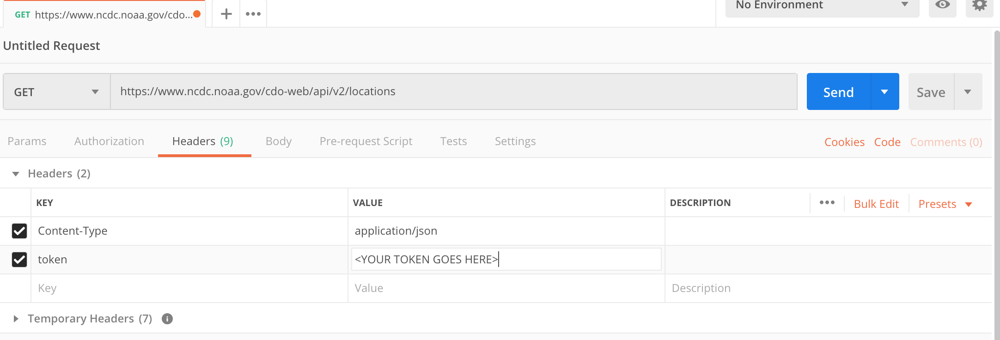

# Data Acqusition Lab


## Getting Started With NOAA's Climate Data API

* Download and install [Postman](https://www.getpostman.com/) or any other freebie HTTP API calling tool.

* Acquire a request token from [NOAA's Climate Data Web Service](https://www.ncdc.noaa.gov/cdo-web/webservices/v2#gettingStarted)

* Using Postman, make a GET request to https://www.ncdc.noaa.gov/cdo-web/api/v2/locations/.
  Be sure to provide the token header.



* Once the response if fullfilled, the bottom pane should display the response. It should look something like the following:

```json
{
    "metadata": {
        "resultset": {
            "offset": 1,
            "count": 38859,
            "limit": 25
        }
    },
    "results": [
        {
            "mindate": "1983-01-01",
            "maxdate": "2019-11-16",
            "name": "Abu Dhabi, AE",
            "datacoverage": 1,
            "id": "CITY:AE000001"
        },
        ...
    ]
}
```


## Automating Data Acquisition

We can see from the response that there are 38,859 results. We only received 25. 

By reading the [documentation](https://www.ncdc.noaa.gov/cdo-web/webservices/v2#locations), we can see that NOAA's api allows us to fetch 1000 locations per request by adding the **limit** argument to our rest call.
We can also see that we can add an **offset** argument to determine the first record from the result set. By combining these two approaches we could make 39 rest calls and acquire all of the data. 
But doing this in Postman would be tedious. What if we had to make 1,000 rest calls? What if we had to make 50,000 rest call to acquire all of the data we needed? 
Let's automate this process so we can spend our time on more important things. 
Luckily Python has all of the tooling we need to help us accomplish this task.

### Your task

1. Create a script called **make_requests.py**
2. Using [urllib.request](https://docs.python.org/3/library/urllib.request.html#module-urllib.request) module, make it so that your script makes rest calls to NOAA's api and saves the results to json files.
3. Once it is executed, you should have 39 files. 
The files should be named as follows:
* locations_0.json 
* locations_1.json
* locations_3.json
* ...
* locations_37.json
* locations_38.json

Example:

**locations_0.json**
```json
{
    "metadata": {
        "resultset": {
            "offset": 1,
            "count": 38859,
            "limit": 1000
        }
    },
    "results": [
        {
            "mindate": "1983-01-01",
            "maxdate": "2019-11-16",
            "name": "Abu Dhabi, AE",
            "datacoverage": 1,
            "id": "CITY:AE000001"
        },
        ...
    ]
}
```

**locations_1.json**
```json
{
    "metadata": {
        "resultset": {
            "offset": 1001,
            "count": 38859,
            "limit": 1000
        }
    },
    "results": [
        {
            "mindate": "1974-08-01",
            "maxdate": "2019-11-16",
            "name": "Mersin, TU",
            "datacoverage": 0.9986,
            "id": "CITY:TU000042"
        },
        ...
    ]
}
```

### Tips

* NOAA's APIs limits how many rest calls you can make in a day. Be sure to test your code in chunks to avoid accidently exausting all of your alloted calls due to a bug in your code.

* Break the problem down.  
  * Test your script with just one call first. 
  * Then try to enhance it so that it can make 3-4 calls on a single execution.
  * Once you have the last two parts, change the parameters so that it runs all of the remaining calls on its own.
