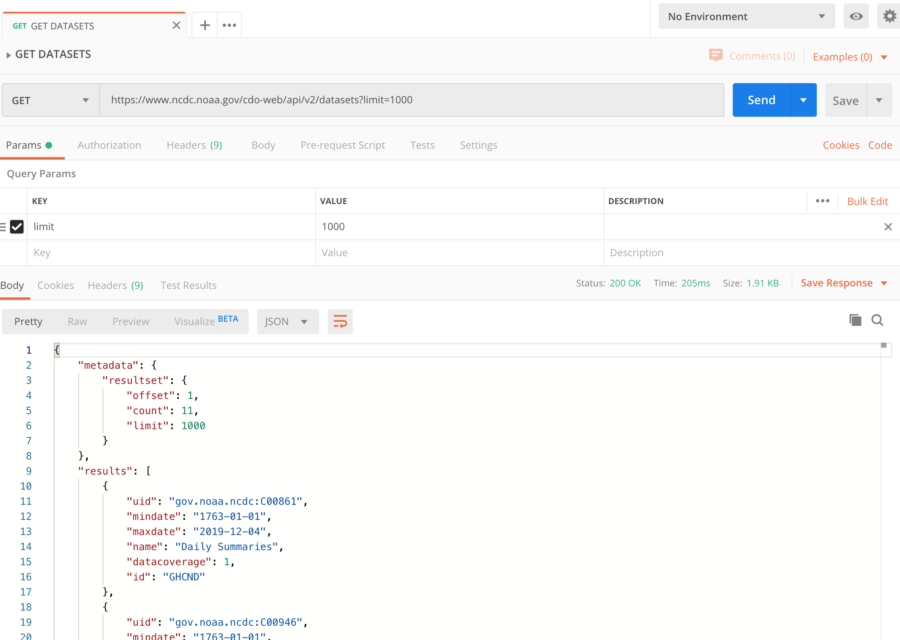
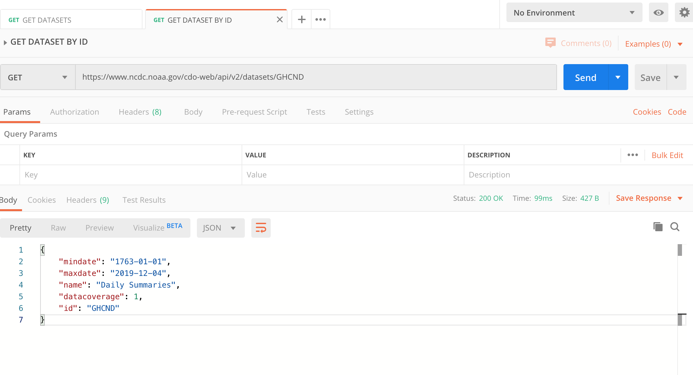

# NOAA Daily Summaries

### Prerequisite 

[NOAALocations](https://github.com/Zipcoder/DataEngineering.Labs.NOAALocations)

### Exercise 1 

Let's continue to explore the data provided by NOAA's climate data api. 
By using the [web services documentation](https://www.ncdc.noaa.gov/cdo-web/webservices/v2#datasets), 
we can see that they provide an endpoint which allows us to learn more about the datasets that are available.

**Important:** Remember to pass the token header in order to access the service.

We can see from the response that there are 11 different data sets we can query through this api. 
The first result has an id of "GHCND" and a name of "Daily Summaries". 
This data seems interesting. Let's dive a bit deeper into this dataset. 

The web services documentation shows that we can specify an id to get information about a particular dataset. 
Let's try it.

Hmm... that didn't provide us with any additional information than what we already had. 
If we navigate the site and search through the web page, we can find the 
[Dataset Discovery](https://www.ncdc.noaa.gov/cdo-web/datasets) page with more details about this dataset. 

If you expand this item and click on the link that says "More", it will take us to the 
[Dataset Overview](https://www.ncei.noaa.gov/metadata/geoportal/rest/metadata/item/gov.noaa.ncdc:C00861/html) page for 
this dataset. 

From there, we can click on Documentation and choose 
[GHCN-Daily README File](https://www1.ncdc.noaa.gov/pub/data/ghcn/daily/readme.txt) to acquire more details about the 
data.

By studying the README file we can see that this dataset provides a couple of interesting fields.
* TMAX = Maximum temperature (tenths of degrees C)
* TMIN = Minimum temperature (tenths of degrees C)

On the next exercise, we will fetch some of the data for this dataset and perform some basic exploration of said data 
focusing on the fields TMIN and TMAX.

### Exercise 2

Let's get our hands on some daily summary data for each day in December 2018 for all of New Castle County, Delaware. 

Between the previous exercises and the 
[web services documentation page for data](https://www.ncdc.noaa.gov/cdo-web/webservices/v2#data), 
you should have all you need to query the service. You may need to make more than one rest request to acquire all of the
 data.

Were you able to figure it out? Check your parameters against the table below (spoilers ahead)

    

| parameter  | value      | 
| ---------- | ---------- |
| datasetid  |  GHCND     |
| locationid | FIPS:10003 |
| startdate  | 2018-01-01 |
| enddate    | 2018-01-31 |
| limit      | 1000       | 
| offset     | *          | 

* The first rest call will have an offset of 1. The second rest call will have an offset of 1001.

The URL for the second rest request should look like the following:
 https://www.ncdc.noaa.gov/cdo-web/api/v2/data?datasetid=GHCND&locationid=FIPS:10003&startdate=2018-01-01&enddate=2018-01-31&limit=1000&offset=1001

Save the ouput to files in the data/daily_summaries directory:
* daily_summaries_FIPS10003_jan_2018_0.json
* daily_summaries_FIPS10003_jan_2018_1.json

Take a few minutes to familiarize yourself with this data. 

### Exercise 3

Yet again we have the need to read json data and convert it to dataframe. Rather than keep repeating ourselves, 
let's adjust the work we did on the NOAALocations lab and create a *json_helper.py* module.

### Exercise 4

* Open the notebook called *loading_and_graphing_daily_summaries.ipynb*
* Follow the directions provided in the notebook and complete the cells as directed.
